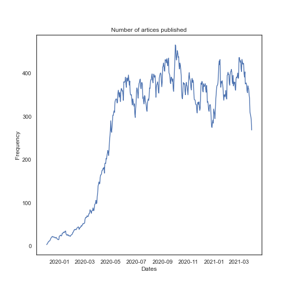
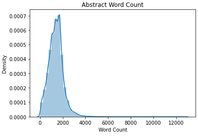
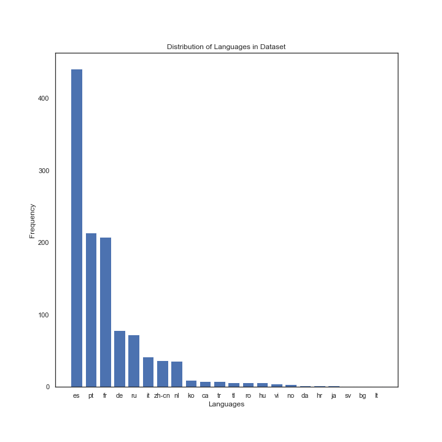
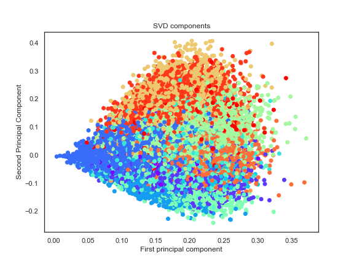
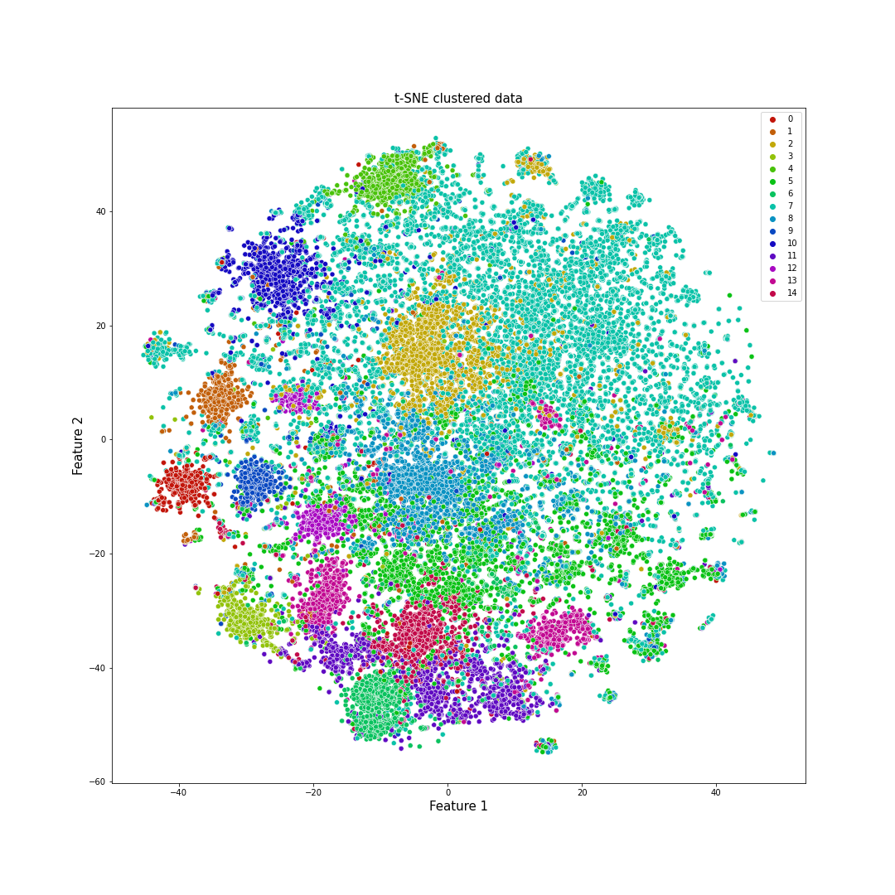

# Covid-19 - Analysis and Document Clustering   <!-- omit in toc -->

Millions accross the world have been affected by the Covid-19 pandemic and the only question on everyone's mind is "When will all this end" and "When will things go back to normal". As we look for these answers, in this first part of the project we will aim to visualize how it all started and how the number of total cases, recovered cases and deaths have changed during the corse of the pandemic.

In the second part, we will try and cluster documents into informative clusters and use LDA to model the cluster topics. The goal behind this is to help sort through the valuable information avialable and make it accessible to the public.

#### -- Project Status: [Completed]

# Table of Contents<!-- omit in toc -->

- [Synopsis](#synopsis)
- [Part 1 - Covid Cases Analysis](#covid-cases-analysis)
- [Dataset](#dataset)
  - [Summary of the Dataset](#summary-of-the-dataset)
  - [Charts and Figures](#charts-and-figures)
- [Part 2 - Document Clustering](#covid-document-clustering)
- [Dataset](#dataset2)
  - [Summary of the Dataset](#summary-of-the-dataset2)
  - [Exploratory Analysis](#eda)
  - [Dimensionality reduction and clustering](#clustering)
  - [LDA](#lda)
- [Conclusion](#conclusion)

# Synopsis 

Coivd-19 has changed how we live our lives and conduct day to day activies for the forseeable future. What started as a single case in the town of Wuhan, China has grown to become a global pandemic. The best we can do to contribute is to stay indoors, wear a mask and sanitize our hands regularly. 

The purpose of this project is to visualize the spread of the coronavirus and then use clustering and LDA to conduct topic modelling on over 400,000 scholary articles that have been published about Covid. These articles are a important source of information for a lot of people and having the right article come up at the right time is critical. 

# Part 1 - Covid Cases Analysis 

# Dataset 

The datasets used for this part of the project can be found on Kaggle: 

https://www.kaggle.com/sudalairajkumar/novel-corona-virus-2019-dataset

## Summary of the Dataset 

 - This dataset contains daily reported cases for different countries and provinces. 
 - The dataset is in a very useable format, except there are some missing values for Province. Since we are trying to visualize the data country-wise this is not a problem.
 - The dataset also contains country names are that slightly modified than what Plotly expects to see, for example: 'Mainland China'. While not all the names can be changed,        Mainland China is converted to China for visulization.

## Charts and Figures 

 - From the plot below, it can be seen how the 1 case in China started to spread across Europe and America and the eventual outbreak in countries like the US and UK.

  

# Part 2 - Document Clustering 

# Dataset 
The datasets used for this part of the project can be found on Kaggle:

https://www.kaggle.com/allen-institute-for-ai/CORD-19-research-challenge

For document clustering, only the abstract and title will be used due to computational power and time. However using the full text and more data will result in better clustering.

## Summary of the Dataset 

 - The metadata.csv file contains information on different scholary articles published on COVID-19. The columns used for this project are:
      - Title, Abstract and Data Published
  - The data also contains missing values and duplicates which are removed as part of the pre-processing and cleaning

## Exploratory Analysis 

- Majority of the artices are published on the new year's date, however to get a better sense of how the number of articles changed over time, the following trend is observed:

- The average length of abstracts is around 2,000 words but there are several outliers where the word count is over 10,000 words.

 - Of the 50,000 subset, most of the articles are in Enlgish. The distribution of artices in other languages is as follows:
 
  

- Words like covid, pandemic and virus are removed from the abstract in order to get unique words for different articles to assist in clustering. The following the the word cloud for the articles:

  

## Dimensionality reduction and clustering 

- In order to cluster the data using NLP, the data is first cleaned to remove any stopwords, punctuations and lower cased for text matching. Futhermore, the data is lemmetized. Lemmatization is the process of grouping together the different inflected forms of a word so they can be analysed as a single item.

- The data is then vectorized using Tf-idf, which counts the frequency of a words in a given document and then penalizes the word based on its frequency is the overall corpus. 

- PCA and SVD are used for dimensionality reduction, keeping only the features that explains 95% of the variance in the data. The first two features are plotted and as expected no apparant clusters can be seen. This is because of the high dimensionality of the data.

- k-Means clustering is conducted, where k=15 is found as the optimal number of clusters based on the elbow plot.
- In order to visualize this, the data is trasformed using t-SNE which helps in visualizing high dimensional data.

## LDA - Topic Modelling 
- LDA is used to model the data into 15 topics. 

| Topics  |  |
| ------------- | ------------- |
| Risks  | Vaccine development  |
| Antibody Testing  | Drugs  |
| Healthcare  | Immune Response  |
| Existing conditions  | Respiratory disease  |
| Country analysis  | Online Learning  |
| Parenting and symptoms  | Distance Measures  |
| Testing Methods  | Mental Health |
| High risk groups  |   |

## Conclusion 

Supervised learning algorithms can then be trained on pre-clustered data to predict the clusters of new and unseen articles. This is a powerful tool and is currently being used by companies like Google for news clustering.

When training a logsitic regression model on the data and 15 clusters, an accuracy score of 0.97 was obtained for the train data and 0.94 for the test/validation data.

