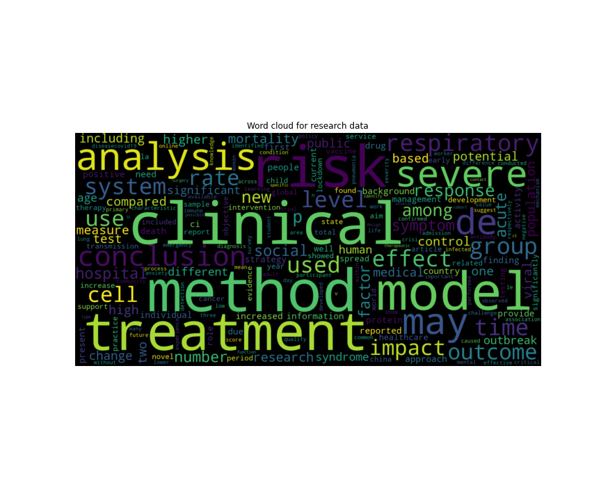

# Covid-19 - Analysis and Document Clustering   <!-- omit in toc -->

Millions accross the world have been affected by the Covid-19 pandemic and the only question on everyone's mind is "When will all this end" and "When will things go back to normal". As we look for these answers, in this first part of the project we will aim to visualize how it all started and how the number of total cases, recovered cases and deaths have changed during the corse of the pandemic.

In the second part, we will try and cluster documents into informative clusters and use LDA to model the cluster topics. The goal behind this is to help sort through the valuable information avialable and make it accessible to the public.

#### -- Project Status: [Completed]

# Table of Contents<!-- omit in toc -->

- [Synopsis](#synopsis)
- [Part 1 - Covid Cases Analysis](#covid-cases-analysis)
- [Dataset](#dataset)
  - [Summary of the Dataset](#summary-of-the-dataset)
  - [Charts and Figures](#charts-and-figures)
- [Part 2 - Document Clustering](#covid-document-clustering)
- [Dataset](#dataset2)
  - [Summary of the Dataset](#summary-of-the-dataset2)
  - [Charts and Figures](#charts-and-figures2)
- [Conclusion](#conclusion-)

# Synopsis 

Coivd-19 has changed how we live our lives and conduct day to day activies for the forseeable future. What started as a single case in the town of Wuhan, China has grown to become a global pandemic. The best we can do to contribute is to stay indoors, wear a mask and sanitize our hands regularly. 

The purpose of this project is to visualize the spread of the coronavirus and then use clustering and LDA to conduct topic modelling on over 400,000 scholary articles that have been published about Covid. These articles are a important source of information for a lot of people and having the right article come up at the right time is critical. 

# Part 1 - Covid Cases Analysis 

# Dataset 

The datasets used for this part of the project can be found on Kaggle: 

https://www.kaggle.com/sudalairajkumar/novel-corona-virus-2019-dataset

## Summary of the Dataset 

 - This dataset contains daily reported cases for different countries and provinces. 
 - The dataset is in a very useable format, except there are some missing values for Province. Since we are trying to visualize the data country-wise this is not a problem.
 - The dataset also contains country names are that slightly modified than what Plotly expects to see, for example: 'Mainland China'. While not all the names can be changed,        Mainland China is converted to China for visulization.

## Charts and Figures 

 - From the plot below, it can be seen how the 1 case in China started to spread across Europe and America and the eventual outbreak in countries like the US and UK.

  

# Part 2 - Document Clustering 

# Dataset 
The datasets used for this part of the project can be found on Kaggle:

https://www.kaggle.com/allen-institute-for-ai/CORD-19-research-challenge

## Summary of the Dataset 

## Charts and Figures 

